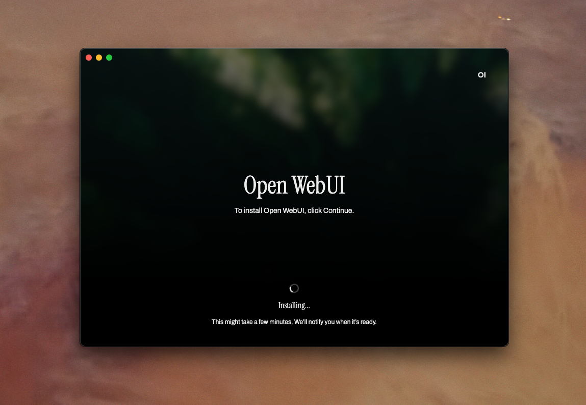

# Open WebUI App (Experimental) 🚀

**Open WebUI App** is the upcoming cross-platform desktop application for [Open WebUI](https://github.com/open-webui/open-webui). It brings the *full-featured Open WebUI experience* directly to your device, effectively transforming it into a powerful server—without the complexities of manual setup. 

This project is still in an **experimental phase** and under active development. 🛠️ Expect frequent updates and potential changes as we refine the application.

---

## Features (Planned & Implemented)
- **One-Click Installation (Implemented)**: Quickly and effortlessly install and set up Open WebUI with all its dependencies. This feature is fully functional and ready to make your setup a breeze.
- **Remote Server Integration**: Easily connect to and manage remote Open WebUI instances.
- **Cross-Platform Support**: Compatible with Windows, macOS, and Linux to ensure broad accessibility.

---

## License 📜
This project is licensed under the [BSD-3-Clause License](LICENSE).

---

## Stay Tuned! 🌟
We're actively developing Open WebUI App. Follow [Open WebUI](https://github.com/open-webui/open-webui) for updates, and join the [community on Discord](https://discord.gg/5rJgQTnV4s) to stay involved.

Let’s build something amazing together! 💪